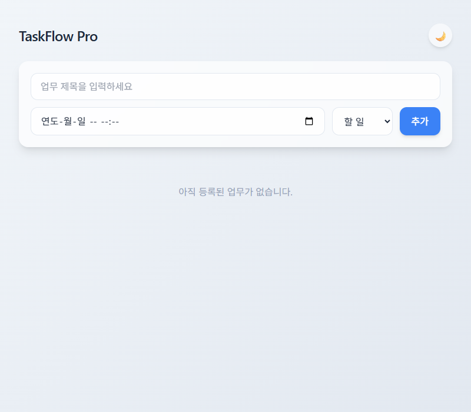
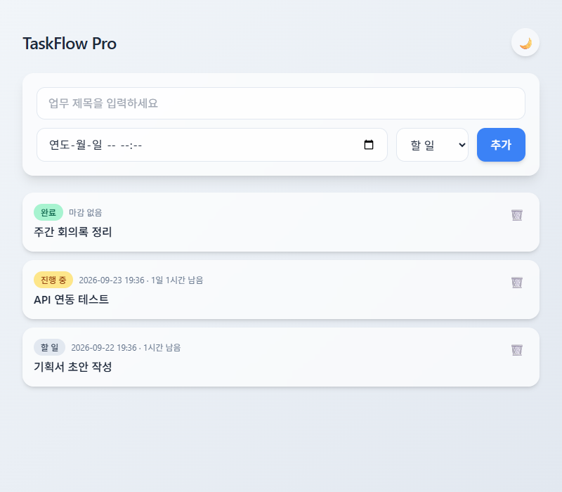
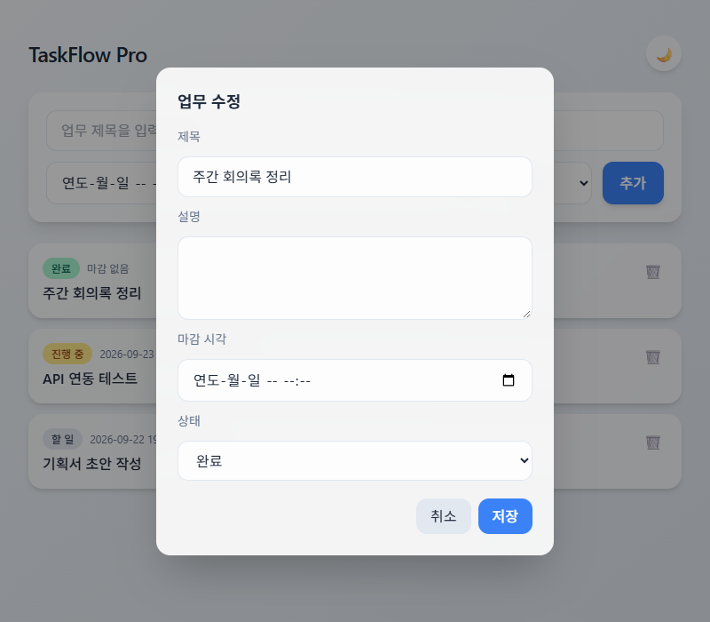
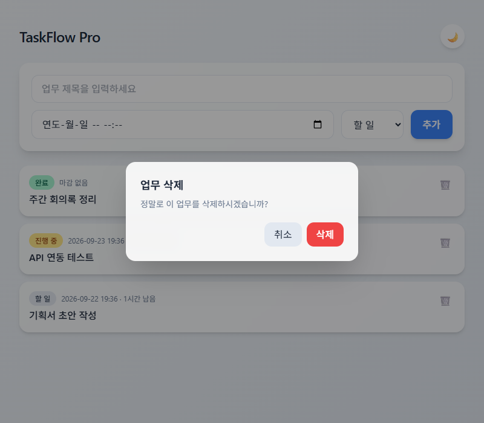
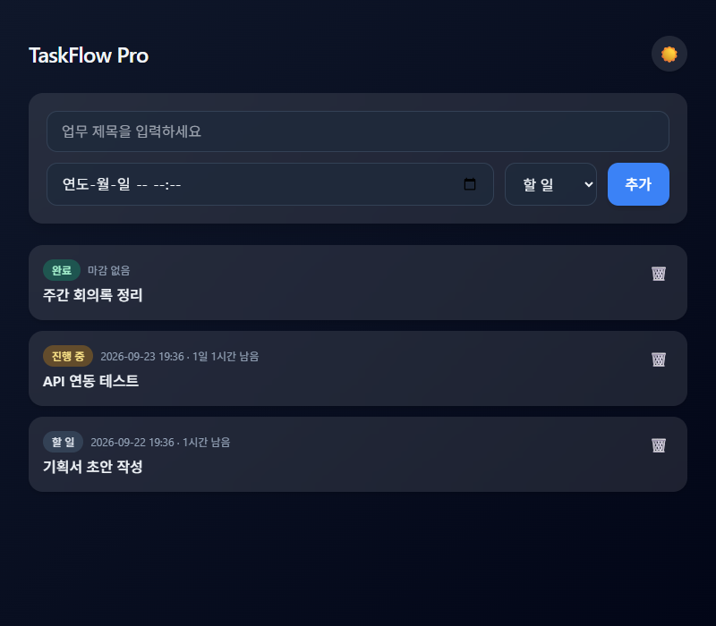
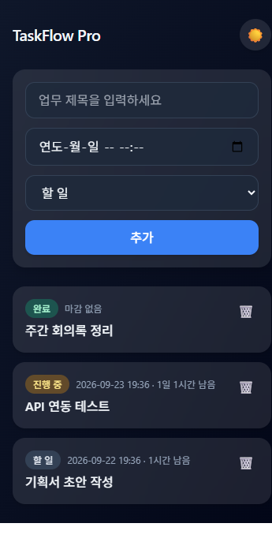

# TaskFlow Pro

팀 업무 관리 풀스택 웹 앱. "지금 누가 뭐 해?"가 사라지게 한다.

## 기술 스택
- 백엔드: FastAPI + Python 3.11+ + SQLite (`backend/`)
- 프론트: Vanilla JS + Tailwind CDN (`frontend/`)
- 테스트: pytest

## 동작 플로우

### 1. 목록 화면 (빈 상태)
서버 기동 후 처음 접속하면 추가 폼과 빈 목록이 보인다.

### 2. 업무 추가 → 목록 카드
폼에서 제목/마감 시각/상태를 입력해 추가하면 카드로 목록에 나타난다. 카드에는 상태 배지와
마감까지 남은 시간이 함께 표시된다(3초 폴링으로 자동 갱신).

### 3. 카드 클릭 → 수정 모달
카드를 클릭하면 해당 업무의 전 필드(제목/설명/마감 시각/상태)를 수정할 수 있는 모달이 뜬다.

### 4. 휴지통 클릭 → 삭제 확인
카드의 휴지통 아이콘을 클릭하면 삭제 여부를 확인하는 다이얼로그가 뜨고, 확인해야 실제
`DELETE` 요청이 전송된다.

### 5. 다크 테마 토글
우측 상단 버튼으로 라이트/다크 테마를 전환할 수 있고, 선택한 테마는 `localStorage`에
저장되어 새로고침해도 유지된다.

### 6. 모바일 반응형 (360px)
360px 폭에서도 레이아웃이 깨지지 않고 세로로 자연스럽게 쌓인다.

## 문서
프로젝트 규칙과 설계는 [CLAUDE.md](./CLAUDE.md)와 `docs/` 폴더를 참고한다.

1. [docs/00-overview.md](./docs/00-overview.md) - 개요
2. [docs/01-product.md](./docs/01-product.md) - 제품 정의
3. [docs/02-specs.md](./docs/02-specs.md) - 기능 명세
4. [docs/03-design.md](./docs/03-design.md) - 설계 문서
5. [docs/04-tasks.md](./docs/04-tasks.md) - 작업 목록
6. [docs/05-conventions.md](./docs/05-conventions.md) - 컨벤션

## 진행 상태
- Phase 1 (설계): 완료
- Phase 2 (백엔드): 완료
- Phase 3 (프론트): 완료
